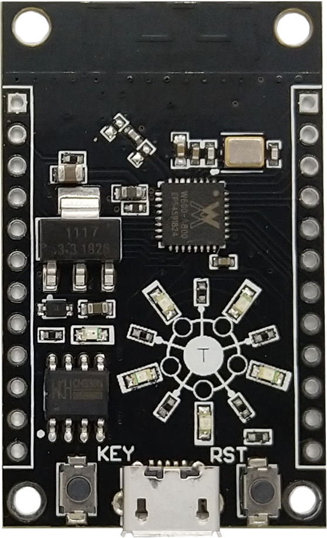

## 入门指导

本文档旨在指导用户创建 W600 的软件环境。本文将通过一个简单的例子来说明如何使用 W600 进行应用开发，包括环境配置、程序编译、固件下载等步骤。

### 1 概述

W600是联盛德新一代支持多接口、多协议的无线局域网802.11n（1T1R）低功耗 WLAN SoC 芯片。芯片内置 Cortex-M3 CPU处理器和Flash，集成射频收发前端RF Transceiver，CMOS PA功率放大器，基带处理器/媒体访问控制，集成电源管理电路，支持丰富的外围接口， 支持多种加解密协议。W600提供给客户的二次开发空间更大、芯片外围电路器件更少、开发更简便，性价比更优势。

W600芯片只有5mm x 5mm 大小，但集成度非常高。芯片内部集成了 RF Switch、Balun、低噪声放大器、滤波器、功率放大器、电源管理模块等，此外还内置了1MByte Flash，使得芯片外围电路器件更少，且模块体积更小、成本更优。W600不仅提供了更加丰富的接口和更大的内存空间，还集成了各种加解密硬件加速器，可提供更快的加解密算法执行速度。芯片采用业界通用的 Cortex-M3 处理器，代码可移植性更强、开发环境友善。

### 2 准备工作

- **电脑**：目前仅支持  Windows 操作系统（需使用 MDK ）
- **工具链**：MDK (后续支持 GCC)
- **TB-01 开发板**（或其它 W600 模组、开发板） 
- **Micro USB 线**（需支持数据传输）

### 3 开发板介绍

TB-01 是一款基于联盛德 W600 的超小体积核心开发板，该开发板引出了芯片的所有IO，并且内置LDO和UART传输芯片，只需一根 Micro USB 数据线与电脑连接即可使用，支持一键下载，外设拥有5个环形LED和2颗按键，调试操作极其方便。

### 4 MDK 环境搭建

由于 SDK 需要 Cortex-M3 的 Device Pack 支持，如果在线下载速度较慢 或 安装遇到问题，建议安装 [MDK 5](https://www.keil.com/download/product/) 的同时也安装对应的 [Legacy 版本](http://www.keil.com/mdk5/legacy/)

#### 4.1 打开工程

下载 [WM_SDK_W600]() ，解压后，打开 **WM_SDK\Tools\Keil\Project\WM_W600.uvproj** 文件

`注意：若提示工程打开失败，请检查 MDK 是否按照上一章节进行正确配置`

#### 4.2 修改 Demo 示例

找到main.c，此处的 void UserMain(void) 是用户程序的函数入口

修改 SDK 打印信息

#### 4.3 编译固件

点击菜单栏可进行编译

控制台窗口输出如下：

### 5 固件烧录与调试

__注意：由于我们在硬件上将 W600 的 RESET 引脚和串口芯片的 RTS 引脚连接在了一起，当您在使用其它串口工具（如 SecureCRT）时，需要去掉开发板上面的 R100 电阻，否则串口可能会无输出。__

固件烧录和调试需依赖[星通智联串口调试助手](/tools)

#### 5.1 连接设备

1. 将开发板与电脑通过 Micro USB 线进行连接

2. 打开星通智联串口调试助手

3. 打开对应的串口，并点击 **复位设备**(或按下 RST 按键) 进行设备复位

4. 串口打印信息如下，说明开发板正常工作

   

   **如有异常，请参考以下方法进行检查**

   - 检查拔插设备时**设备管理器**是否有变化（变化部分为串口），并检查 [串口驱动](http://wch.cn/downloads/file/65.html) 是否安装成功；

   - 若未能发现新增串口，请尝试更换一根 Micro USB 数据线；

   - 出现其它打印信息内容或者乱码，请联系对应的销售人员或技术支持人员；

#### 5.2 固件烧录及运行

1. 选择对应的固件，支持 FLS 和 img 格式；
    `FLS 是 WM_W600_sec.img + secboot.img 的合并文件，一般用于芯片的首次下载，之后仅烧录 WM_W600_SEC.img即可。`

2. 点击“下载”进行固件下载，`波特率默认使用 115200 bps，近期会提升到 2Mbps！`；

3. 观察固件运行信息

    

### 结束

恭喜你已完成 W600的入门！

现在你可以尝试其他的示例工程或者直接开发自己的应用程序。